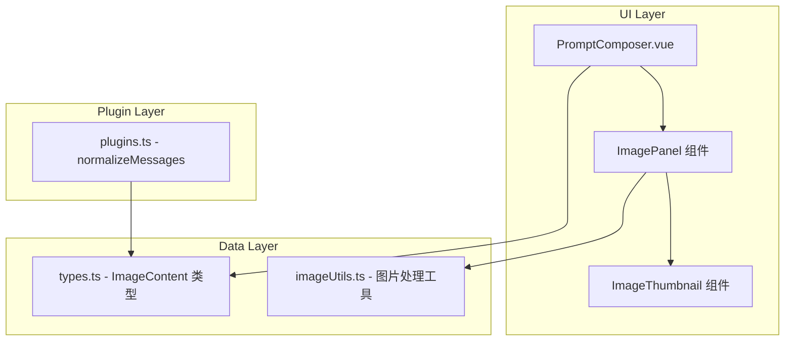

# Design Document: VL Image Upload

## Overview

本设计为 PromptComposer 组件添加图片支持功能，使用户能够在 User Message 中附加图片，以便调用视觉语言模型（VL Model）。支持两种图片来源：URL 和本地文件上传（Base64 编码）。

## Architecture



### 数据流

1. 用户在 PromptComposer 中点击图片按钮
2. ImagePanel 展开，用户选择 URL 或文件上传
3. 图片数据存储到 UserPromptPreset.images 数组
4. 构建 API 请求时，normalizeMessages 将图片转换为 OpenAI Vision API 格式

## Components and Interfaces

### 1. ImagePanel 组件

内嵌在 PromptComposer 的消息卡片中，提供图片添加功能。

```typescript
// ImagePanel.vue props
interface ImagePanelProps {
  images: ImageContent[];
  onAdd: (image: ImageContent) => void;
  onRemove: (index: number) => void;
}
```

### 2. ImageThumbnail 组件

显示单个图片缩略图，支持删除和信息提示。

```typescript
// ImageThumbnail.vue props
interface ImageThumbnailProps {
  image: ImageContent;
  onRemove: () => void;
}
```

### 3. imageUtils.ts 工具函数

使用浏览器原生 API（FileReader、URL API）处理图片，不引入额外库：

```typescript
// 文件转 Base64 - 使用 FileReader API
function fileToBase64(file: File): Promise<string> {
  return new Promise((resolve, reject) => {
    const reader = new FileReader();
    reader.onload = () => resolve(reader.result as string);
    reader.onerror = reject;
    reader.readAsDataURL(file);
  });
}

// 获取图片 MIME 类型 - 直接从 File.type 获取
function getImageMimeType(file: File): string {
  return file.type || 'image/png';
}

// 估算 Base64 数据大小 - 简单计算
function estimateBase64Size(base64: string): string {
  // Base64 编码后大小约为原始大小的 4/3
  const bytes = Math.ceil((base64.length * 3) / 4);
  if (bytes < 1024) return `${bytes} B`;
  if (bytes < 1024 * 1024) return `${(bytes / 1024).toFixed(1)} KB`;
  return `${(bytes / (1024 * 1024)).toFixed(1)} MB`;
}

// 验证图片 URL - 使用 URL API
function isValidImageUrl(url: string): boolean {
  try {
    new URL(url);
    return /\.(jpg|jpeg|png|gif|webp|svg)(\?.*)?$/i.test(url) || 
           url.startsWith('data:image/');
  } catch {
    return false;
  }
}

// 从 data URL 提取 Base64 和 MIME 类型
function parseDataUrl(dataUrl: string): { base64: string; mimeType: string } | null {
  const match = dataUrl.match(/^data:(image\/[^;]+);base64,(.+)$/);
  if (!match) return null;
  return { mimeType: match[1], base64: match[2] };
}
```

**注意**: 所有图片处理均使用浏览器原生 API，无需引入第三方库。FileReader 是 Web 标准 API，兼容所有现代浏览器。

## Data Models

### ImageContent 类型

```typescript
// 添加到 types.ts
export type ImageContent = {
  id: string;
  type: 'url' | 'base64';
  url?: string;           // type === 'url' 时使用
  base64?: string;        // type === 'base64' 时使用
  mimeType?: string;      // type === 'base64' 时使用，如 'image/png'
  name?: string;          // 文件名（可选，用于显示）
};

// 扩展 UserPromptPreset
export type UserPromptPreset = {
  id: string;
  role: 'system' | 'user' | 'assistant';
  text: string;
  images?: ImageContent[];  // 新增：图片列表
};
```

### OpenAI Vision API 格式

```typescript
// API 请求中的消息格式
type VisionMessage = {
  role: string;
  content: Array<
    | { type: 'text'; text: string }
    | { type: 'image_url'; image_url: { url: string } }
  >;
};
```

## Correctness Properties

*A property is a characteristic or behavior that should hold true across all valid executions of a system-essentially, a formal statement about what the system should do. Properties serve as the bridge between human-readable specifications and machine-verifiable correctness guarantees.*

### Property 1: File to Base64 Round Trip
*For any* valid image file, converting it to Base64 and then decoding should produce data equivalent to the original file content.
**Validates: Requirements 1.4**

### Property 2: Image List Addition
*For any* message and any valid image, adding the image to the message should increase the images array length by exactly 1 and the new image should be at the end of the array.
**Validates: Requirements 2.1**

### Property 3: Image List Removal
*For any* message with N images (N > 0) and any valid index i (0 <= i < N), removing the image at index i should result in an array of length N-1 with all other images preserved in order.
**Validates: Requirements 2.2**

### Property 4: API Format Correctness
*For any* message with text and images, the formatted API request should:
- Have content as an array
- Include a text content item with the message text
- Include an image_url content item for each image
- URL images should have their URL directly in image_url.url
- Base64 images should have a data URL format (data:image/[type];base64,[data]) in image_url.url
**Validates: Requirements 3.1, 3.2, 3.3**

### Property 5: Storage Round Trip
*For any* UserPromptPreset with images, serializing to JSON and deserializing should produce an equivalent object with all image data preserved.
**Validates: Requirements 3.4, 3.5**

### Property 6: Role-Based Image Button Visibility
*For any* message, the image attachment button should be visible if and only if the message role is "user".
**Validates: Requirements 5.1, 5.2**

### Property 7: Image Preservation on Role Change
*For any* message with images, changing the role from "user" to another role and back to "user" should preserve all images unchanged.
**Validates: Requirements 5.3, 5.4**

## Error Handling

| 场景 | 处理方式 |
|------|----------|
| 文件读取失败 | 显示 Ant Design message.error，提示具体错误原因 |
| 文件类型不支持 | 文件选择器限制 accept 属性，额外校验后提示 |
| URL 格式无效 | 输入时校验，显示输入框错误状态 |
| 图片加载失败 | 缩略图显示 broken image 占位符 |
| Base64 数据过大 | 警告提示，但不阻止添加 |

## Testing Strategy

### 单元测试

使用 Vitest 进行单元测试：

1. **imageUtils.ts 测试**
   - fileToBase64 正确转换文件
   - getImageMimeType 正确识别类型
   - estimateBase64Size 正确估算大小
   - buildDataUrl 正确构建 data URL

2. **类型验证测试**
   - ImageContent 类型正确性
   - UserPromptPreset 向后兼容性

### 属性测试

使用 fast-check 进行属性测试，每个测试运行至少 100 次迭代：

1. **Property 1 测试**: 生成随机二进制数据，验证 Base64 编解码往返
2. **Property 2 测试**: 生成随机图片列表和新图片，验证添加操作
3. **Property 3 测试**: 生成随机图片列表和索引，验证删除操作
4. **Property 4 测试**: 生成随机消息（含文本和图片），验证 API 格式
5. **Property 5 测试**: 生成随机 UserPromptPreset，验证 JSON 序列化往返
6. **Property 6 测试**: 生成随机角色，验证按钮可见性逻辑
7. **Property 7 测试**: 生成随机消息和角色变更序列，验证图片保留

每个属性测试必须标注：`**Feature: vl-image-upload, Property {number}: {property_text}**`

### 测试框架配置

```typescript
// vitest.config.ts 已配置
// 使用 fast-check 作为属性测试库
import fc from 'fast-check';

// 配置最小迭代次数
fc.configureGlobal({ numRuns: 100 });
```

